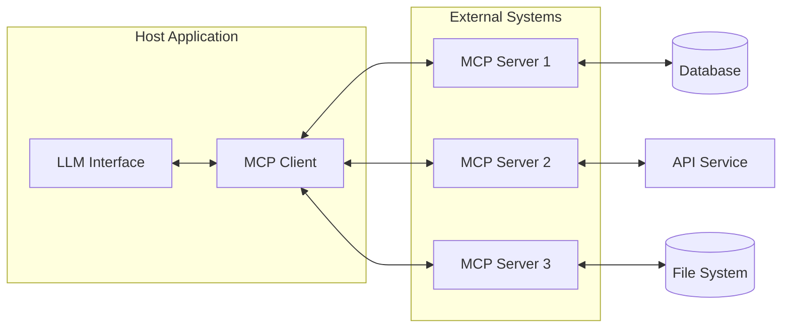
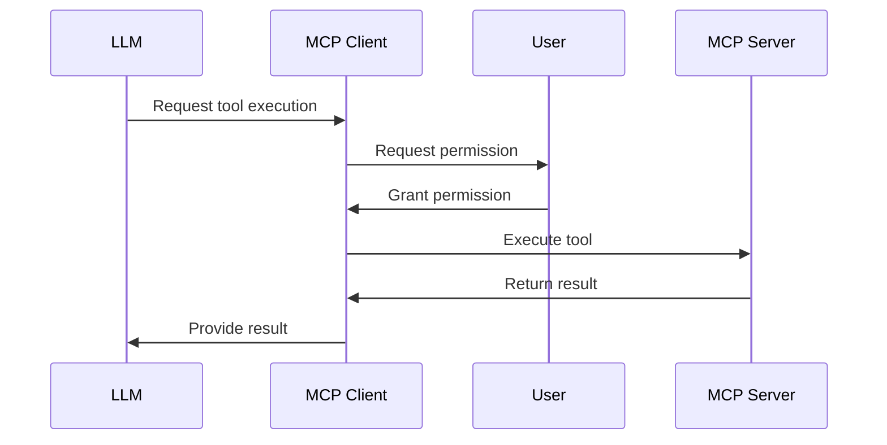
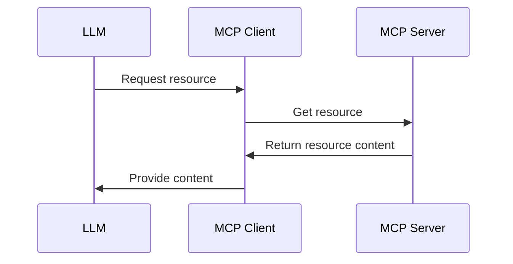
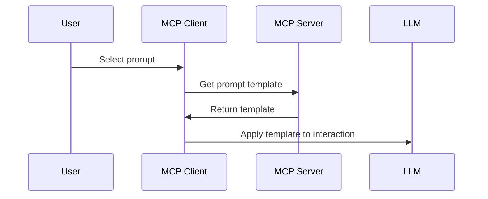

# Introduction to Model Context Protocol (MCP)

## What is MCP?

The Model Context Protocol (MCP) is an open standard that defines how Large Language Models (LLMs) like Claude, GPT, and others can interact with external systems, data sources, and tools. MCP establishes a standardized way for applications to provide context to LLMs, enabling them to access real-time data and perform actions beyond their training data.

Think of MCP as a "USB-C for AI" - a standard interface that allows different LLMs to connect to various data sources and tools without requiring custom integrations for each combination.

## Why MCP Exists

Before MCP, integrating LLMs with external tools and data sources required:

1. Custom integrations for each LLM and tool combination
2. Proprietary protocols specific to each LLM provider
3. Directly exposing APIs and data to the LLM, raising security concerns
4. Duplicating integration efforts across different projects

MCP solves these problems by:

1. **Standardization**: Defining a common protocol for all LLMs and tools
2. **Separation of concerns**: Keeping LLM interactions separate from tool functionality
3. **Security**: Providing controlled access to external systems
4. **Reusability**: Allowing tools to be shared across different LLMs and applications

## Key Benefits of MCP

- **Consistency**: Common interface across different LLMs and tools
- **Modularity**: Tools can be developed independently of LLMs
- **Security**: Fine-grained control over LLM access to systems
- **Ecosystem**: Growing library of pre-built tools and integrations
- **Flexibility**: Support for different transport mechanisms and deployment models
- **Vendor Agnosticism**: Not tied to any specific LLM provider

## Core Architecture

MCP follows a client-server architecture:

- **MCP Host**: An application that hosts an LLM (like Claude desktop app)
- **MCP Client**: The component in the host that communicates with MCP servers
- **MCP Server**: A service that exposes tools, resources, and prompts to clients
- **Transport Layer**: The communication mechanism between clients and servers (stdio, SSE, etc.)

## Core Components

MCP is built around three core primitives:

### 1. Tools

Tools are functions that LLMs can call to perform actions or retrieve information. They follow a request-response pattern, where the LLM provides input parameters and receives a result.

Examples:
- Searching a database
- Calculating values
- Making API calls
- Manipulating files

### 2. Resources

Resources are data sources that LLMs can read. They are identified by URIs and can be static or dynamic.

Examples:
- File contents
- Database records
- API responses
- System information

### 3. Prompts

Prompts are templates that help LLMs interact with servers effectively. They provide structured ways to formulate requests.

Examples:
- Query templates
- Analysis frameworks
- Structured response formats

## Control Flow

An important aspect of MCP is how control flows between components:

| Component | Control | Description |
|-----------|---------|-------------|
| Tools | Model-controlled | LLM decides when to use tools (with user permission) |
| Resources | Application-controlled | The client app determines when to provide resources |
| Prompts | User-controlled | Explicitly selected by users for specific interactions |

This separation of control ensures that each component is used appropriately and securely.

## Transport Mechanisms

MCP supports multiple transport mechanisms for communication between clients and servers:

### 1. Standard Input/Output (stdio)

Uses standard input and output streams for communication. Ideal for:
- Local processes
- Command-line tools
- Simple integrations

### 2. Server-Sent Events (SSE)

Uses HTTP with Server-Sent Events for server-to-client messages and HTTP POST for client-to-server messages. Suitable for:
- Web applications
- Remote services
- Distributed systems

Both transports use [JSON-RPC](https://www.jsonrpc.org/) 2.0 as the messaging format.

## The MCP Ecosystem

The MCP ecosystem consists of:

- **MCP Specification**: The formal protocol definition
- **SDKs**: Libraries for building clients and servers in different languages
- **Pre-built Servers**: Ready-to-use servers for common services
- **Hosts**: Applications that support MCP for LLM interactions
- **Tools**: Community-developed tools and integrations

## Getting Started

To start working with MCP, you'll need:

1. An MCP host (like Claude Desktop or a custom client)
2. Access to MCP servers (pre-built or custom)
3. Basic understanding of the MCP concepts

The following documents in this series will guide you through:
- Building your own MCP servers
- Using existing MCP servers
- Troubleshooting common issues
- Extending the ecosystem with new tools

## Resources

- [Official MCP Documentation](https://modelcontextprotocol.io/)
- [MCP GitHub Organization](https://github.com/modelcontextprotocol)
- [MCP Specification](https://spec.modelcontextprotocol.io/)
- [Example Servers](https://github.com/modelcontextprotocol/servers)
