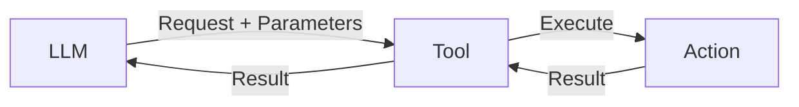
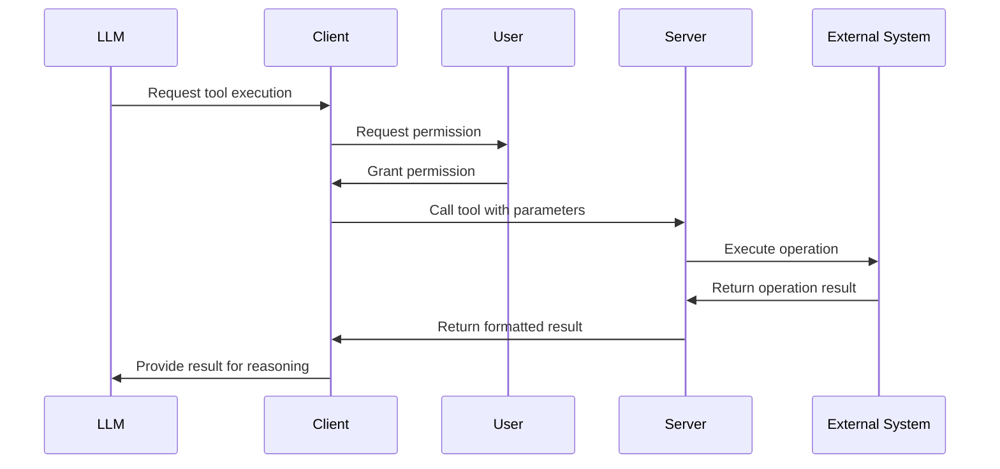
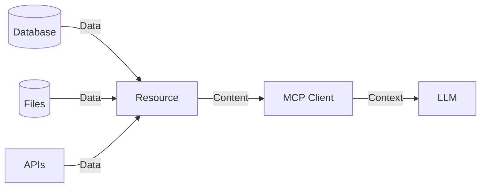
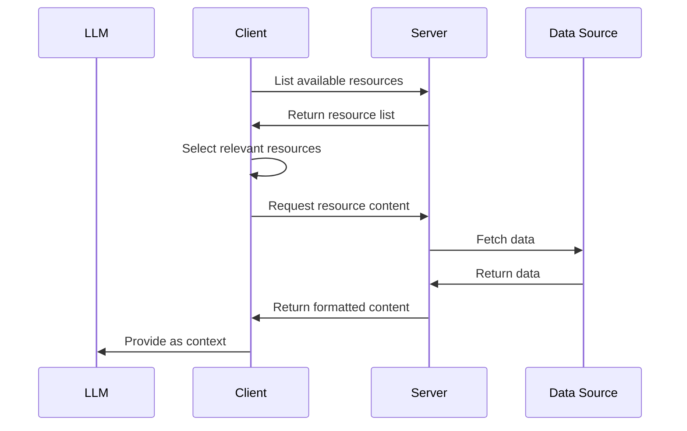
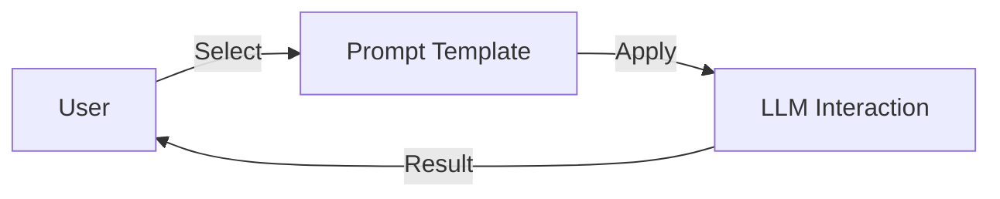
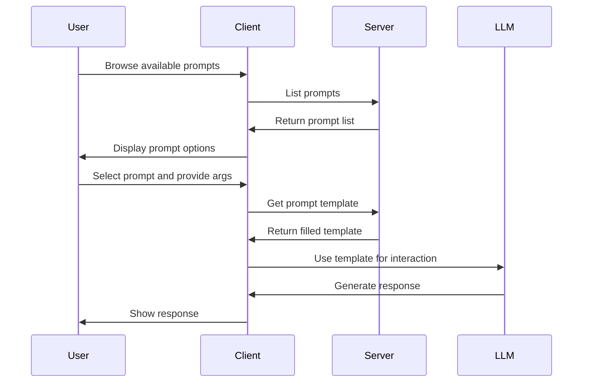
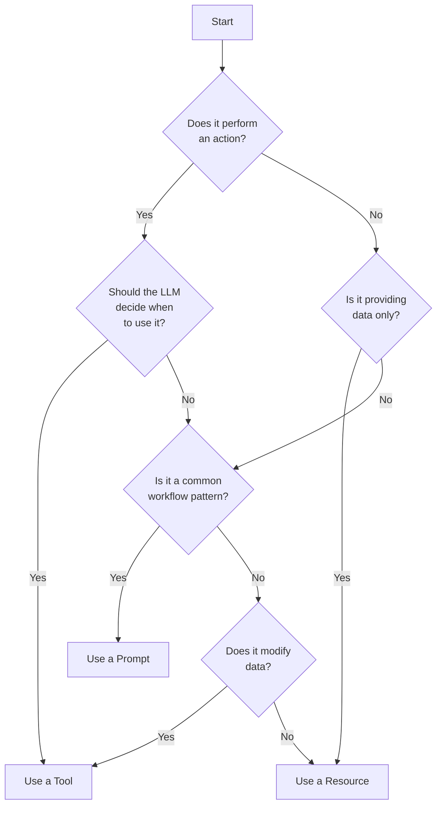
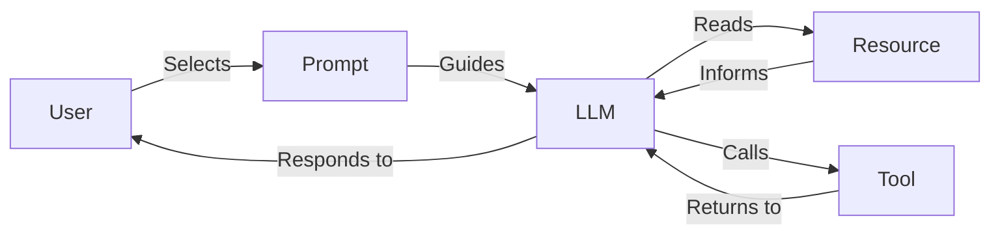

# MCP Core Concepts: Tools, Resources, and Prompts

## Understanding the Core Primitives

The Model Context Protocol (MCP) is built around three foundational primitives that determine how LLMs interact with external systems:

1. **Tools**: Functions that LLMs can call to perform actions
2. **Resources**: Data sources that LLMs can access
3. **Prompts**: Templates that guide LLM interactions

Each primitive serves a distinct purpose in the MCP ecosystem and comes with its own control flow, usage patterns, and implementation considerations. Understanding when and how to use each is essential for effective MCP development.

## The Control Matrix

A key concept in MCP is who controls each primitive:

| Primitive | Control          | Access Pattern  | Typical Use Cases                     | Security Model                     |
|-----------|------------------|-----------------|--------------------------------------|-----------------------------------|
| Tools     | Model-controlled | Execute         | API calls, calculations, processing   | User permission before execution   |
| Resources | App-controlled   | Read            | Files, database records, context      | App decides which resources to use |
| Prompts   | User-controlled  | Apply template  | Structured queries, common workflows  | Explicitly user-selected          |

This control matrix ensures that each component operates within appropriate boundaries and security constraints.

## Tools in Depth

### What Are Tools?

Tools are executable functions that allow LLMs to perform actions and retrieve information. They are analogous to API endpoints but specifically designed for LLM consumption.



### Key Characteristics of Tools

- **Model-controlled**: The LLM decides when to call a tool
- **Request-response pattern**: Tools accept parameters and return results
- **Side effects**: Tools may have side effects (e.g., modifying data)
- **Permission-based**: Tool execution typically requires user permission
- **Formal schema**: Tools have well-defined input and output schemas

### When to Use Tools

Use tools when:

- The LLM needs to perform an action (not just read data)
- The operation has potential side effects
- The operation requires specific parameters
- You want the LLM to decide when to use the functionality
- The operation produces results that affect further LLM reasoning

### Tool Example: Weather Service

```python
@mcp.tool()
async def get_forecast(latitude: float, longitude: float) -> str:
    """
    Get weather forecast for a location.
    
    Args:
        latitude: Latitude of the location
        longitude: Longitude of the location
    
    Returns:
        Formatted forecast text
    """
    # Implementation details...
    return forecast_text
```

### Tool Schema

Each tool provides a JSON Schema that defines its input parameters:

```json
{
  "name": "get_forecast",
  "description": "Get weather forecast for a location",
  "inputSchema": {
    "type": "object",
    "properties": {
      "latitude": {
        "type": "number",
        "description": "Latitude of the location"
      },
      "longitude": {
        "type": "number",
        "description": "Longitude of the location"
      }
    },
    "required": ["latitude", "longitude"]
  }
}
```

### Tool Execution Flow



## Resources in Depth

### What Are Resources?

Resources are data sources that provide context to LLMs. They represent content that an LLM can read but not modify directly.



### Key Characteristics of Resources

- **Application-controlled**: The client app decides which resources to provide
- **Read-only**: Resources are for reading, not modification
- **URI-based**: Resources are identified by URI schemes
- **Content-focused**: Resources provide data, not functionality
- **Context-providing**: Resources enhance the LLM's understanding

### When to Use Resources

Use resources when:

- The LLM needs to read data but not modify it
- The data provides context for reasoning
- The content is static or infrequently changing
- You want control over what data the LLM can access
- The data is too large or complex to include in prompts

### Resource Example: File Reader

```python
@mcp.resource("file://{path}")
async def get_file_content(path: str) -> str:
    """
    Get the content of a file.
    
    Args:
        path: Path to the file
    
    Returns:
        File content as text
    """
    # Implementation details...
    return file_content
```

### Resource URI Templates

Resources often use URI templates to create dynamic resources:

```
file://{path}
database://{table}/{id}
api://{endpoint}/{parameter}
```

This allows for flexible resource addressing while maintaining structure.

### Resource Access Flow



## Prompts in Depth

### What Are Prompts?

Prompts are templates that guide LLM interactions with servers. They provide structured patterns for common operations and workflows.



### Key Characteristics of Prompts

- **User-controlled**: Explicitly selected by users for specific tasks
- **Template-based**: Provide structured formats for interactions
- **Parameterized**: Accept arguments to customize behavior
- **Workflow-oriented**: Often encapsulate multi-step processes
- **Reusable**: Designed for repeated use across similar tasks

### When to Use Prompts

Use prompts when:

- Users perform similar tasks repeatedly
- Complex interactions can be standardized
- You want to ensure consistent LLM behavior
- The interaction follows a predictable pattern
- Users need guidance on how to interact with a tool

### Prompt Example: Code Review

```python
@mcp.prompt()
def code_review(code: str) -> str:
    """
    Create a prompt for code review.
    
    Args:
        code: The code to review
    
    Returns:
        Formatted prompt for LLM
    """
    return f"""
    Please review this code:
    
    ```
    {code}
    ```
    
    Focus on:
    1. Potential bugs
    2. Performance issues
    3. Security concerns
    4. Code style and readability
    """
```

### Prompt Schema

Prompts define their parameters and description:

```json
{
  "name": "code_review",
  "description": "Generate a code review for the provided code",
  "arguments": [
    {
      "name": "code",
      "description": "The code to review",
      "required": true
    }
  ]
}
```

### Prompt Usage Flow



## Comparing the Primitives

### Tools vs. Resources

| Aspect           | Tools                          | Resources                      |
|------------------|--------------------------------|--------------------------------|
| **Purpose**      | Perform actions                | Provide data                   |
| **Control**      | Model-controlled (with permission) | Application-controlled         |
| **Operations**   | Execute functions              | Read content                   |
| **Side Effects** | May have side effects          | No side effects (read-only)    |
| **Schema**       | Input parameters, return value | URI template, content type     |
| **Use Case**     | API calls, calculations        | Files, database records        |
| **Security**     | Permission required            | Pre-selected by application    |

### Tools vs. Prompts

| Aspect           | Tools                          | Prompts                        |
|------------------|--------------------------------|--------------------------------|
| **Purpose**      | Perform actions                | Guide interactions             |
| **Control**      | Model-controlled               | User-controlled                |
| **Operations**   | Execute functions              | Apply templates                |
| **Customization**| Input parameters               | Template arguments             |
| **Use Case**     | Specific operations            | Standardized workflows         |
| **User Interface**| Usually invisible             | Typically visible in UI        |

### Resources vs. Prompts

| Aspect           | Resources                     | Prompts                        |
|------------------|-------------------------------|--------------------------------|
| **Purpose**      | Provide data                  | Guide interactions             |
| **Control**      | Application-controlled        | User-controlled                |
| **Content**      | Dynamic data                  | Structured templates           |
| **Use Case**     | Context enhancement           | Standardized workflows         |
| **Persistence**  | May be cached or real-time    | Generally static               |

## Deciding Which Primitive to Use

When designing MCP servers, choosing the right primitive is critical. Use this decision tree:



### Practical Guidelines

1. **Use Tools when**:
   - The operation performs actions or has side effects
   - The LLM should decide when to use the functionality
   - The operation requires specific input parameters
   - You need to run calculations or process data

2. **Use Resources when**:
   - You need to provide read-only data to the LLM
   - The content is large or structured
   - The data needs to be selected by the application
   - The data provides context for reasoning

3. **Use Prompts when**:
   - Users perform similar tasks repeatedly
   - The interaction follows a predictable pattern
   - You want to ensure consistent behavior
   - Users need guidance on complex interactions

## Combining Primitives

For complex systems, you'll often combine multiple primitives:



Example combinations:

1. **Resource + Tool**: Read a file (resource) then analyze its content (tool)
2. **Prompt + Tool**: Use a standard query format (prompt) to execute a search (tool)
3. **Resource + Prompt**: Load context (resource) then apply a structured analysis template (prompt)
4. **All Three**: Load context (resource), apply analysis template (prompt), and execute operations (tool)

## Best Practices

### Tools
- Keep tools focused on single responsibilities
- Provide clear descriptions and parameter documentation
- Handle errors gracefully and return informative messages
- Implement timeouts for long-running operations
- Log tool usage for debugging and monitoring

### Resources
- Use clear URI schemes that indicate content type
- Implement caching for frequently used resources
- Handle large resources efficiently (pagination, streaming)
- Provide metadata about resources (size, type, etc.)
- Secure access to sensitive resources

### Prompts
- Design for reusability across similar tasks
- Keep prompt templates simple and focused
- Document expected arguments clearly
- Provide examples of how to use prompts
- Test prompts with different inputs

## Conclusion

Understanding the differences between tools, resources, and prompts is fundamental to effective MCP development. By choosing the right primitives for each use case and following best practices, you can create powerful, flexible, and secure MCP servers that enhance LLM capabilities.

The next document in this series will guide you through building MCP servers using Python, where you'll implement these concepts in practice.
