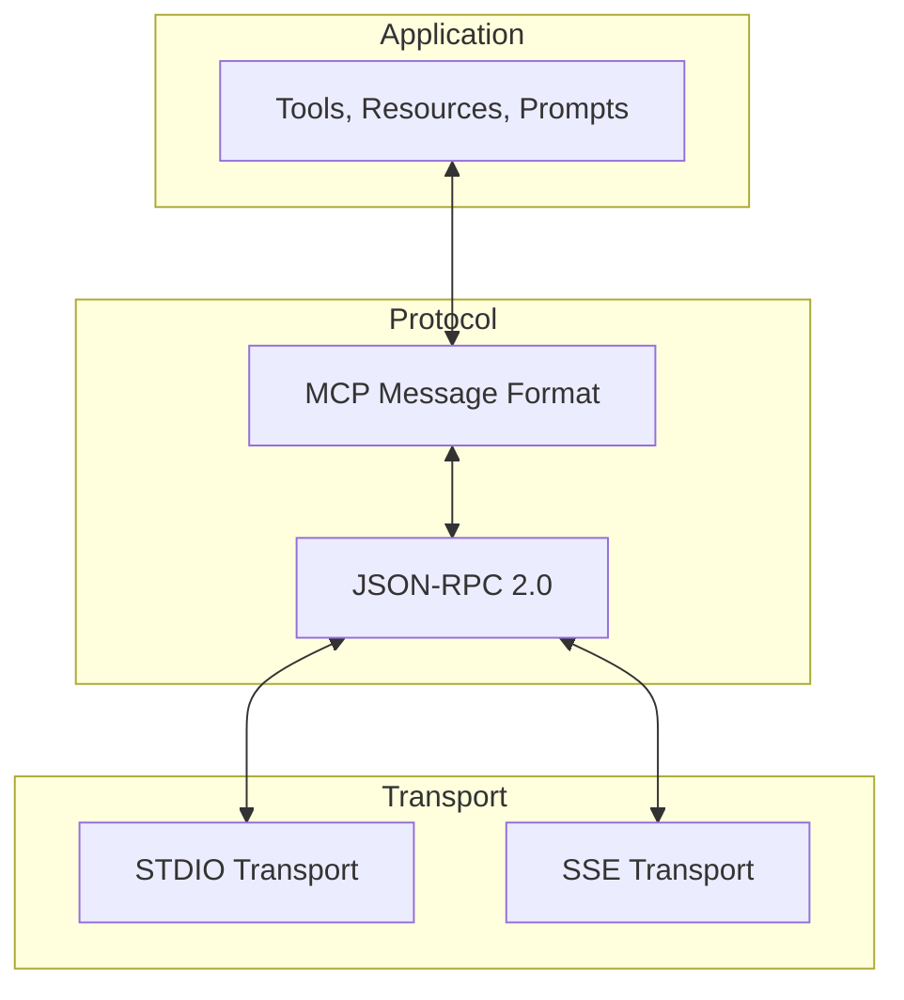
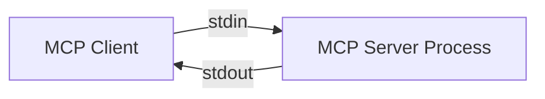
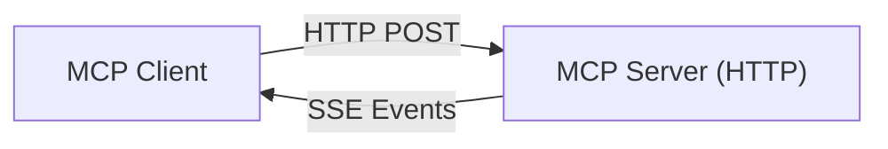
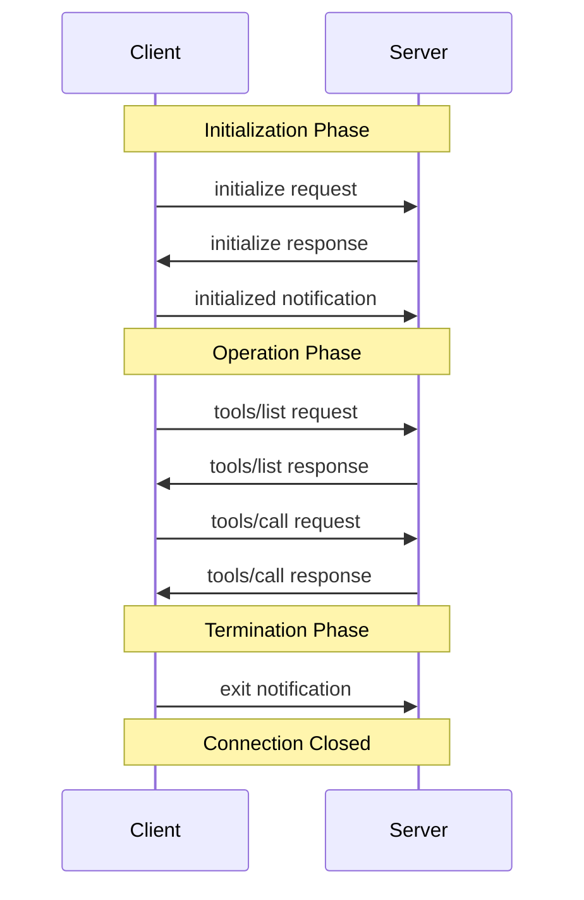

# MCP Communication Protocols

This document provides a detailed exploration of the communication protocols used in the Model Context Protocol (MCP). Understanding these protocols is essential for developing robust MCP servers and clients, and for troubleshooting connection issues.

## Protocol Overview

MCP uses a layered protocol architecture:



The layers are:

1. **Application Layer**: Defines tools, resources, and prompts
2. **Protocol Layer**: Specifies message formats and semantics
3. **Transport Layer**: Handles the physical transmission of messages

## Message Format

MCP uses [JSON-RPC 2.0](https://www.jsonrpc.org/specification) as its message format. This provides a standardized way to structure requests, responses, and notifications.

### JSON-RPC Structure

There are three types of messages in JSON-RPC:

1. **Requests**: Messages that require a response
2. **Responses**: Replies to requests (success or error)
3. **Notifications**: One-way messages that don't expect a response

### Request Format

```json
{
  "jsonrpc": "2.0",
  "id": 1,
  "method": "tools/call",
  "params": {
    "name": "tool_name",
    "arguments": {
      "param1": "value1",
      "param2": 42
    }
  }
}
```

Key components:
- `jsonrpc`: Always "2.0" to indicate JSON-RPC 2.0
- `id`: A unique identifier for matching responses to requests
- `method`: The operation to perform (e.g., "tools/call")
- `params`: Parameters for the method

### Response Format (Success)

```json
{
  "jsonrpc": "2.0",
  "id": 1,
  "result": {
    "content": [
      {
        "type": "text",
        "text": "Operation result"
      }
    ]
  }
}
```

Key components:
- `jsonrpc`: Always "2.0"
- `id`: Matches the id from the request
- `result`: The operation result (structure depends on the method)

### Response Format (Error)

```json
{
  "jsonrpc": "2.0",
  "id": 1,
  "error": {
    "code": -32602,
    "message": "Invalid parameters",
    "data": {
      "details": "Parameter 'param1' is required"
    }
  }
}
```

Key components:
- `jsonrpc`: Always "2.0"
- `id`: Matches the id from the request
- `error`: Error information with code, message, and optional data

### Notification Format

```json
{
  "jsonrpc": "2.0",
  "method": "notifications/resources/list_changed",
  "params": {}
}
```

Key components:
- `jsonrpc`: Always "2.0"
- `method`: The notification type
- `params`: Parameters for the notification (if any)
- No `id` field (distinguishes notifications from requests)

## Transport Methods

MCP supports two main transport methods:

### STDIO Transport

Standard Input/Output (STDIO) transport uses standard input and output streams for communication. This is particularly useful for local processes.



#### Message Framing

STDIO transport uses a simple message framing format:

```
Content-Length: <length>\r\n
\r\n
<message>
```

Where:
- `<length>` is the length of the message in bytes
- `<message>` is the JSON-RPC message

Example:

```
Content-Length: 76
 
{"jsonrpc":"2.0","method":"initialize","id":0,"params":{"version":"1.0.0"}}
```

#### Implementation Details

STDIO transport is implemented by:

1. Starting a child process
2. Writing to the process's standard input
3. Reading from the process's standard output
4. Parsing messages according to the framing format

Python implementation example:

```python
async def read_message(reader):
    # Read headers
    headers = {}
    while True:
        line = await reader.readline()
        line = line.decode('utf-8').strip()
        if not line:
            break
        key, value = line.split(': ', 1)
        headers[key] = value
    
    # Get content length
    content_length = int(headers.get('Content-Length', 0))
    
    # Read content
    content = await reader.read(content_length)
    return json.loads(content)

async def write_message(writer, message):
    # Serialize message
    content = json.dumps(message).encode('utf-8')
    
    # Write headers
    header = f'Content-Length: {len(content)}\r\n\r\n'
    writer.write(header.encode('utf-8'))
    
    # Write content
    writer.write(content)
    await writer.drain()
```

#### Advantages and Limitations

Advantages:
- Simple to implement
- Works well for local processes
- No network configuration required
- Natural process lifecycle management

Limitations:
- Only works for local processes
- Limited to one client per server
- No built-in authentication
- Potential blocking issues

### SSE Transport

Server-Sent Events (SSE) transport uses HTTP for client-to-server requests and SSE for server-to-client messages. This is suitable for web applications and remote servers.



#### Client-to-Server Messages

Client-to-server messages are sent using HTTP POST requests:

```
POST /message HTTP/1.1
Content-Type: application/json

{"jsonrpc":"2.0","method":"tools/call","id":1,"params":{...}}
```

#### Server-to-Client Messages

Server-to-client messages are sent using SSE events:

```
event: message
data: {"jsonrpc":"2.0","id":1,"result":{...}}

```

#### Implementation Details

SSE transport implementation requires:

1. An HTTP server endpoint for accepting client POST requests
2. An SSE endpoint for sending server messages to clients
3. Proper HTTP and SSE headers and formatting

Python implementation example (using aiohttp):

```python
from aiohttp import web
import json

# For server-to-client messages (SSE)
async def sse_handler(request):
    response = web.Response(
        content_type='text/event-stream',
        headers={
            'Cache-Control': 'no-cache',
            'Connection': 'keep-alive',
            'Access-Control-Allow-Origin': '*'
        }
    )
    
    response.enable_chunked_encoding()
    
    # Get the response writer
    writer = response.write
    
    # Store the client connection
    client_id = request.query.get('id', 'unknown')
    clients[client_id] = writer
    
    # Keep the connection open
    while True:
        await asyncio.sleep(1)
    
    return response

# For client-to-server messages (HTTP POST)
async def message_handler(request):
    # Parse the message
    data = await request.json()
    
    # Process the message
    result = await process_message(data)
    
    # If it's a request (has an ID), send the response via SSE
    if 'id' in data:
        client_id = request.query.get('id', 'unknown')
        if client_id in clients:
            writer = clients[client_id]
            message = json.dumps(result)
            await writer(f'event: message\ndata: {message}\n\n')
    
    # Return an acknowledgment
    return web.Response(text='OK')

# Send an SSE message to a client
async def send_sse_message(client_id, message):
    if client_id in clients:
        writer = clients[client_id]
        data = json.dumps(message)
        await writer(f'event: message\ndata: {data}\n\n')
```

#### Advantages and Limitations

Advantages:
- Works over standard HTTP
- Supports remote clients
- Can serve multiple clients
- Integrates with web infrastructure

Limitations:
- More complex to implement
- Requires HTTP server
- Connection management is more challenging
- Potential firewall issues

## Protocol Lifecycle

The MCP protocol follows a defined lifecycle:



### Initialization Phase

The initialization phase establishes the connection and negotiates capabilities:

1. **initialize request**: Client sends protocol version and supported capabilities
2. **initialize response**: Server responds with its version and capabilities
3. **initialized notification**: Client acknowledges initialization

Initialize request example:

```json
{
  "jsonrpc": "2.0",
  "id": 0,
  "method": "initialize",
  "params": {
    "clientInfo": {
      "name": "example-client",
      "version": "1.0.0"
    },
    "capabilities": {
      "tools": {
        "listChanged": true
      },
      "resources": {
        "listChanged": true,
        "subscribe": true
      },
      "prompts": {
        "listChanged": true
      }
    }
  }
}
```

Initialize response example:

```json
{
  "jsonrpc": "2.0",
  "id": 0,
  "result": {
    "serverInfo": {
      "name": "example-server",
      "version": "1.0.0"
    },
    "capabilities": {
      "tools": {
        "listChanged": true
      },
      "resources": {
        "listChanged": true,
        "subscribe": true
      },
      "prompts": {
        "listChanged": true
      },
      "experimental": {}
    }
  }
}
```

Initialized notification example:

```json
{
  "jsonrpc": "2.0",
  "method": "initialized",
  "params": {}
}
```

### Operation Phase

During the operation phase, clients and servers exchange various requests and notifications:

1. **Feature Discovery**: Listing tools, resources, and prompts
2. **Tool Execution**: Calling tools and receiving results
3. **Resource Access**: Reading resources and subscribing to changes
4. **Prompt Usage**: Getting prompt templates
5. **Notifications**: Receiving updates about changes

### Termination Phase

The termination phase cleanly closes the connection:

1. **exit notification**: Client indicates it's closing the connection
2. **Connection closure**: Transport connection is closed

Exit notification example:

```json
{
  "jsonrpc": "2.0",
  "method": "exit",
  "params": {}
}
```

## Message Types and Methods

MCP defines several standard message types for different operations:

### Tools Methods

| Method | Type | Description |
|--------|------|-------------|
| `tools/list` | Request/Response | List available tools |
| `tools/call` | Request/Response | Execute a tool with parameters |
| `notifications/tools/list_changed` | Notification | Notify that the tool list has changed |

Example tools/list request:
```json
{
  "jsonrpc": "2.0",
  "id": 1,
  "method": "tools/list"
}
```

Example tools/list response:
```json
{
  "jsonrpc": "2.0",
  "id": 1,
  "result": {
    "tools": [
      {
        "name": "web_scrape",
        "description": "Scrape content from a URL",
        "inputSchema": {
          "type": "object",
          "properties": {
            "url": {
              "type": "string",
              "description": "The URL to scrape"
            }
          },
          "required": ["url"]
        }
      }
    ]
  }
}
```

### Resources Methods

| Method | Type | Description |
|--------|------|-------------|
| `resources/list` | Request/Response | List available resources |
| `resources/read` | Request/Response | Read a resource by URI |
| `resources/subscribe` | Request/Response | Subscribe to resource updates |
| `resources/unsubscribe` | Request/Response | Unsubscribe from resource updates |
| `notifications/resources/list_changed` | Notification | Notify that the resource list has changed |
| `notifications/resources/updated` | Notification | Notify that a resource has been updated |

Example resources/read request:
```json
{
  "jsonrpc": "2.0",
  "id": 2,
  "method": "resources/read",
  "params": {
    "uri": "file:///path/to/file.txt"
  }
}
```

Example resources/read response:
```json
{
  "jsonrpc": "2.0",
  "id": 2,
  "result": {
    "contents": [
      {
        "uri": "file:///path/to/file.txt",
        "text": "File content goes here",
        "mimeType": "text/plain"
      }
    ]
  }
}
```

### Prompts Methods

| Method | Type | Description |
|--------|------|-------------|
| `prompts/list` | Request/Response | List available prompts |
| `prompts/get` | Request/Response | Get a prompt by name |
| `notifications/prompts/list_changed` | Notification | Notify that the prompt list has changed |

Example prompts/get request:
```json
{
  "jsonrpc": "2.0",
  "id": 3,
  "method": "prompts/get",
  "params": {
    "name": "code_review",
    "arguments": {
      "language": "python",
      "code": "def hello(): print('Hello, world!')"
    }
  }
}
```

Example prompts/get response:
```json
{
  "jsonrpc": "2.0",
  "id": 3,
  "result": {
    "messages": [
      {
        "role": "user",
        "content": {
          "type": "text",
          "text": "Please review this Python code:\n\ndef hello(): print('Hello, world!')"
        }
      }
    ]
  }
}
```

### Logging and Progress

| Method | Type | Description |
|--------|------|-------------|
| `notifications/logging/message` | Notification | Log a message |
| `notifications/progress` | Notification | Report progress of a long-running operation |

Example logging notification:
```json
{
  "jsonrpc": "2.0",
  "method": "notifications/logging/message",
  "params": {
    "level": "info",
    "message": "Operation started",
    "data": { 
      "operation": "file_processing" 
    }
  }
}
```

Example progress notification:
```json
{
  "jsonrpc": "2.0",
  "method": "notifications/progress",
  "params": {
    "token": "operation-123",
    "value": 50
  }
}
```

## Error Codes

MCP uses standard JSON-RPC error codes plus additional codes for specific errors:

| Code | Name | Description |
|------|------|-------------|
| -32700 | Parse Error | Invalid JSON |
| -32600 | Invalid Request | Request not conforming to JSON-RPC |
| -32601 | Method Not Found | Method not supported |
| -32602 | Invalid Params | Invalid parameters |
| -32603 | Internal Error | Internal server error |
| -32000 | Server Error | Server-specific error |
| -32001 | Resource Not Found | Resource URI not found |
| -32002 | Tool Not Found | Tool name not found |
| -32003 | Prompt Not Found | Prompt name not found |
| -32004 | Execution Failed | Tool execution failed |
| -32005 | Permission Denied | Operation not permitted |

## Protocol Extensions

The MCP protocol supports extensions through the "experimental" capability field:

```json
{
  "capabilities": {
    "experimental": {
      "customFeature": {
        "enabled": true,
        "options": { ... }
      }
    }
  }
}
```

Extensions should follow these guidelines:

1. Use namespaced method names (e.g., "customFeature/operation")
2. Document the extension clearly
3. Provide fallback behavior when the extension is not supported
4. Consider standardization for widely used extensions

## Troubleshooting Protocol Issues

Common protocol issues include:

### Initialization Problems

1. **Version Mismatch**: Client and server using incompatible protocol versions
   - Check version in initialize request/response
   - Update client or server to compatible versions

2. **Capability Negotiation Failure**: Client and server capabilities don't match
   - Verify capabilities in initialize request/response
   - Update client or server to support required capabilities

### Message Format Issues

1. **Invalid JSON**: Message contains malformed JSON
   - Check message format before sending
   - Validate JSON with a schema

2. **Missing Fields**: Required fields are missing
   - Ensure all required fields are present
   - Use a protocol validation library

3. **Incorrect Types**: Fields have incorrect types
   - Validate field types before sending
   - Use typed interfaces for messages

### Transport Issues

1. **Connection Lost**: Transport connection unexpectedly closed
   - Implement reconnection logic
   - Handle connection failures gracefully

2. **Message Framing**: Incorrect message framing (STDIO)
   - Ensure Content-Length is correct
   - Validate message framing format

3. **SSE Connection**: SSE connection issues
   - Check network connectivity
   - Verify SSE endpoint is accessible

### Tool Call Issues

1. **Invalid Parameters**: Tool parameters don't match schema
   - Validate parameters against schema
   - Provide descriptive error messages

2. **Execution Failure**: Tool execution fails
   - Handle exceptions in tool implementation
   - Return appropriate error responses

### Debugging Techniques

1. **Message Logging**: Log all protocol messages
   - Set up logging before and after sending/receiving
   - Log both raw and parsed messages

2. **Protocol Tracing**: Enable protocol tracing
   - Set environment variables for trace logging
   - Use MCP Inspector for visual tracing

3. **Transport Monitoring**: Monitor transport state
   - Check connection status
   - Log transport events

## Conclusion

Understanding the MCP communication protocols is essential for building robust MCP servers and clients. By following the standard message formats and transport mechanisms, you can ensure reliable communication between LLMs and external tools and data sources.

In the next document, we'll explore common troubleshooting techniques and solutions for MCP servers.
